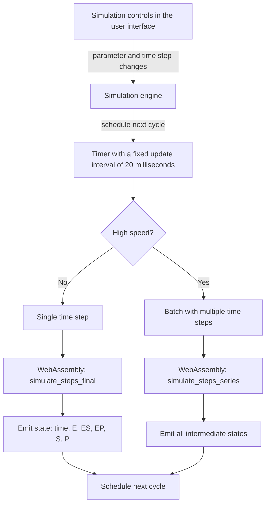
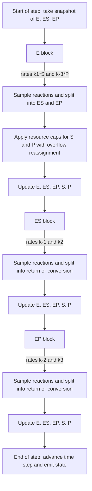

# Enzyme kinetics simulation algorithms

This document describes the two aggregated stochastic algorithms implemented in the Rust-based WebAssembly module (`wasm/src/lib.rs`) and how they relate to the original per-molecule loop in JavaScript (`src/lib/precise-simulation.ts`).

- Current implementation (default): tau-leap with competing risks (Section B)
- Previous aggregated implementation: linear per-step thresholds (Section A)

The public functions are unchanged: `simulate_steps_final(...)` and `simulate_steps_series(...)` take species quantities and reaction constants and return either the final state or the full series of states.

## Notation
- Species quantities at the start of each step: `E, ES, EP, S, P` (non‑negative). For sampling, they are rounded to integers at the beginning of the step.
- Reaction constants: `k1, k-3, k-1, k2, k-2, k3` (intensities per time step).
- Random number generator: the same source used by JavaScript.
- Binomial sampling: exact for small sizes; Poisson approximation when size×probability is small; normal approximation otherwise.

Both algorithms update the species in three consecutive blocks per step, following the original engine order:
1) Free enzymes `E` can bind with `S` (→ ES) or with `P` (→ EP)
2) Complex `ES` can dissociate (→ E+S) or convert (→ EP)
3) Complex `EP` can dissociate (→ ES) or convert (→ E+P)

Mass conservation holds by construction in each block.

## Overall design diagram

---

## A) Linear per-step thresholds (previous aggregated model)

This model mirrors the per-molecule "if / else if" in JavaScript by using linear probabilities per step.

- For free `E`:
  - `q1 = clamp01(k1 * S)` is the probability that a molecule of `E` forms `ES`.
  - `q2_raw = clamp01(k-3 * P)` is the probability to form `EP`, considered second.
  - Effective probability `q2 = min(1, q1 + q2_raw) - q1` to preserve the sequential logic.
  - Sampling: `n_ES ~ Binomial(NEL, q1)` and then, from the remaining enzymes, `n_EP ~ Binomial(NEL - n_ES, q2 / (1 - q1))`.
  - Resource limits: `n_ES <= S`, `n_EP <= P`.

- For `ES`:
  - `r1 = clamp01(k-1)`, `r2_raw = clamp01(k2)`; apply the same sequential logic.

- For `EP`:
  - `s1 = clamp01(k-2)`, `s2_raw = clamp01(k3)`; apply the same sequential logic.

Properties:
- Simple and matches JavaScript for small probabilities.
- Not scale-invariant: multiplying quantities (E, S, P, …) while keeping constants fixed makes `k*S` grow, probabilities saturate to 1, and dynamics change.

---

## B) Tau-leap with competing risks (current model)

This model treats reactions from each state as exponential risks that compete during the duration of one time step. It is a standard tau-leaping discretization of a continuous-time Markov chain.

### B.1 Free E block
- Per-molecule rates (hazards): `λ1 = k1 * S`, `λ2 = k-3 * P`
- Total probability that a molecule of `E` reacts in the step: `p_tot = 1 - exp(-(λ1 + λ2))`
- Conditional split: `p(ES | react) = λ1 / (λ1 + λ2)`, `p(EP | react) = λ2 / (λ1 + λ2)`
- Aggregated sampling:
  1) `n_react ~ Binomial(NEL, p_tot)`
  2) `n_ES_raw ~ Binomial(n_react, λ1/(λ1+λ2))`, `n_EP_raw = n_react - n_ES_raw`
  3) Resource caps with reassignment: `n_ES = min(n_ES_raw, S)`, `n_EP = min(n_EP_raw, P)`; if one channel overflows due to lack of `S` or `P`, the leftover is reassigned to the other channel up to its remaining resource availability.
  4) Update:
     - `E -= (n_ES + n_EP)`
     - `ES += n_ES`, `EP += n_EP`
     - `S -= n_ES`, `P -= n_EP`

### B.2 ES block
- Rates: `λ1_ES = k-1`, `λ2_ES = k2`
- `p_tot_ES = 1 - exp(-(λ1_ES + λ2_ES))`
- `n_react_ES ~ Binomial(NES, p_tot_ES)`
- Split: `to_EL ~ Binomial(n_react_ES, λ1_ES/(λ1_ES+λ2_ES))`, `to_EP = n_react_ES - to_EL`
- Update: `E += to_EL`, `S += to_EL`, `ES -= (to_EL + to_EP)`, `EP += to_EP`

### B.3 EP block
- Rates: `λ1_EP = k-2`, `λ2_EP = k3`
- `p_tot_EP = 1 - exp(-(λ1_EP + λ2_EP))`
- `n_react_EP ~ Binomial(NEP, p_tot_EP)`
- Split: `to_ES ~ Binomial(n_react_EP, λ1_EP/(λ1_EP+λ2_EP))`, `to_E = n_react_EP - to_ES`
- Update: `ES += to_ES`, `EP -= (to_ES + to_E)`, `E += to_E`, `P += to_E`

### Properties
- For small rates: `exp(-x) ≈ 1 - x`, hence `p_tot ≈ λ1 + λ2`; the model matches the linear thresholds to first order.
- Behavior under scaling: multiplying quantities while keeping constants preserves relative hazards and yields stable dynamics without premature saturation.
- Mass conservation is respected in each block.

### Approximations
- The binomial sampler uses a hybrid strategy for performance: sums of Bernoulli for small sizes, Poisson when size×probability is small, and normal approximation otherwise. This preserves mean and variance well for large-scale runs.
- Quantities are rounded to integers at sampling boundaries to align with the JavaScript engine behavior.

### Edge cases and clamps
- All quantities are clamped to be non‑negative before and after updates.
- If `λ1+λ2 = 0`, no reaction occurs in that block (`p_tot = 0`).
- Resource caps are only relevant in the `E` block, because forming complexes requires `S` or `P`; the `ES` and `EP` blocks do not consume external resources.

---

## Implementation pointers
- See `simulate_steps_final()` and `simulate_steps_series()` in `wasm/src/lib.rs`.
- Both functions share the same tau-leap logic.
- The `E` block includes overflow reassignment between `ES` and `EP` when `S` or `P` are insufficient during the step.

---

## Per-cycle steps diagram

---

## Optimizations compared to the original algorithm

- **WebAssembly execution (Rust)**: the entire state evolution runs in WebAssembly for higher performance and numerical consistency.
- **Emission of every time step**: even at high speeds, every intermediate step is emitted, avoiding visual time skipping.
- **Single-step first cycle**: the first cycle forces a single step to eliminate the initial time jump.
- **Batches with full series and stable cadence**: at high speeds a batch of steps is computed in WebAssembly and all intermediate states are emitted while keeping approximately fifty updates per second.
- **Hybrid binomial sampling**: combined strategy (sums of Bernoulli, Poisson and normal) that preserves mean and variance and accelerates large runs.
- **Overflow reassignment when resources are lacking**: when `S` or `P` are insufficient in the `E` block, the excess is reassigned to the other channel if possible.
- **Initial snapshot of counts**: decisions for `E`, `ES` and `EP` use the counts at the beginning of the step, avoiding dependence on in-step update order.
- **Removal of the JavaScript path**: the engine no longer uses the alternative computation in JavaScript, avoiding discrepancies between paths.
- **Robust WebAssembly initialization**: if the environment is not ready yet, the engine retries without advancing the state.
- **Mass conservation and stability**: block updates enforce conservation and avoid negative values.

---

## Validation tips
- Compare two scenarios that differ by a global scaling factor (for example, multiply all initial quantities by 1000 while keeping the same constants). With the tau-leap model the shapes should remain consistent up to scale.
- For small quantities and small constants, both models should produce similar trajectories (within stochastic noise).
- Monitor `E + ES + EP` and `S + P + (ES + EP)` to verify mass conservation.

---

## Public functions compatibility
- There are no changes to the exported functions or to the TypeScript wrapper `src/lib/wasm-sim.ts`.
- The engine now executes exclusively in WebAssembly; the alternative path in JavaScript has been removed from the simulation engine.
