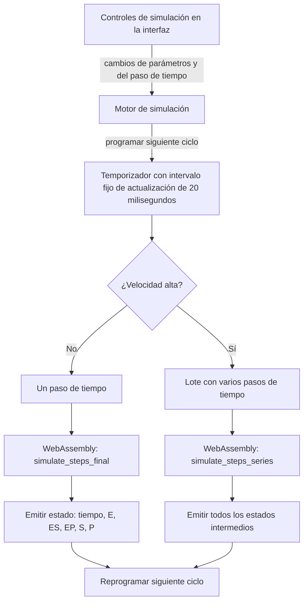
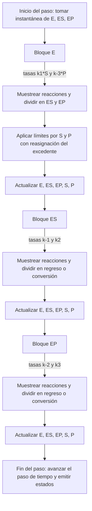

# Algoritmos de simulación de cinética enzimática

Este documento describe los dos algoritmos estocásticos agregados implementados en el módulo de WebAssembly escrito en Rust (`wasm/src/lib.rs`) y cómo se relacionan con el bucle original por molécula en JavaScript (`src/lib/precise-simulation.ts`).

- Implementación actual (predeterminada): salto tau con riesgos competidores (Sección B)
- Implementación agregada anterior: umbrales lineales por paso (Sección A)

Las funciones públicas no han cambiado: `simulate_steps_final(...)` y `simulate_steps_series(...)` reciben cantidades y constantes de reacción y devuelven el estado final o la serie de estados.

## Notación
- Cantidades de especies al inicio de cada paso: `E, ES, EP, S, P` (valores no negativos). Para muestrear, internamente se redondean a enteros al comienzo del paso.
- Constantes de reacción: `k1, k-3, k-1, k2, k-2, k3` (intensidades por paso de tiempo).
- Generador de números aleatorios: la misma fuente que JavaScript.
- Muestreo binomial: exacto para tamaños pequeños; aproximación de Poisson cuando el producto tamaño·probabilidad es pequeño; aproximación normal en caso contrario.

Ambos algoritmos actualizan las especies en tres bloques consecutivos por paso, respetando el orden del motor original:
1) Las enzimas libres `E` pueden unirse con `S` (→ ES) o con `P` (→ EP)
2) El complejo `ES` puede desasociarse (→ E+S) o convertirse (→ EP)
3) El complejo `EP` puede desasociarse (→ ES) o convertirse (→ E+P)

La conservación de masa se cumple por construcción en cada bloque.

## Diagrama general del diseño

---

## A) Umbrales lineales por paso (modelo agregado anterior)

Este modelo refleja directamente el "si / en caso contrario" por molécula en JavaScript empleando probabilidades lineales por paso.

- Para `E` libre:
  - `q1 = clamp01(k1 * S)` es la probabilidad de que una `E` forme `ES`.
  - `q2_raw = clamp01(k-3 * P)` es la probabilidad de formar `EP` considerada en segundo lugar.
  - Probabilidad efectiva `q2 = min(1, q1 + q2_raw) - q1` para preservar la lógica secuencial.
  - Muestreo `n_ES ~ Binomial(NEL, q1)` y luego, con las enzimas restantes, `n_EP ~ Binomial(NEL - n_ES, q2 / (1 - q1))`.
  - Límite por recursos: `n_ES <= S`, `n_EP <= P`.

- Para `ES`:
  - `r1 = clamp01(k-1)`, `r2_raw = clamp01(k2)`; se aplica la misma lógica secuencial.

- Para `EP`:
  - `s1 = clamp01(k-2)`, `s2_raw = clamp01(k3)`; se aplica la misma lógica secuencial.

Propiedades:
- Sencillo y coincide con el comportamiento en JavaScript para probabilidades pequeñas.
- No es invariante a escala: si se multiplican las cantidades (E, S, P, …) manteniendo fijas las `k`, `k*S` crece, las probabilidades se saturan a 1 y cambian las dinámicas.

---

## B) Salto tau con riesgos competidores (modelo actual)

Este modelo trata las reacciones desde cada estado como riesgos exponenciales que compiten durante la duración de un paso de tiempo. Es una discretización estándar por salto tau de una cadena de Markov en tiempo continuo.

### B.1 Free E block
- Per-molecule rates (hazards): `λ1 = k1 * S`, `λ2 = k-3 * P`
- Total probability that an `E` reacts in the step: `p_tot = 1 - exp(-(λ1 + λ2))`
- Conditional split: `p(ES | react) = λ1 / (λ1 + λ2)`, `p(EP | react) = λ2 / (λ1 + λ2)`
- Aggregated sampling:
  1) `n_react ~ Binomial(NEL, p_tot)`
  2) `n_ES_raw ~ Binomial(n_react, λ1/(λ1+λ2))`, `n_EP_raw = n_react - n_ES_raw`
  3) Resource caps with reassignment: `n_ES = min(n_ES_raw, S)`, `n_EP = min(n_EP_raw, P)`; if one channel overflows due to lack of `S` or `P`, the leftover is reassigned to the other channel up to its remaining resource availability.
  4) Update:
     - `E -= (n_ES + n_EP)`
     - `ES += n_ES`, `EP += n_EP`
     - `S -= n_ES`, `P -= n_EP`

### B.2 ES block
- Rates: `λ1_ES = k-1`, `λ2_ES = k2`
- `p_tot_ES = 1 - exp(-(λ1_ES + λ2_ES))`
- `n_react_ES ~ Binomial(NES, p_tot_ES)`
- Split: `to_EL ~ Binomial(n_react_ES, λ1_ES/(λ1_ES+λ2_ES))`, `to_EP = n_react_ES - to_EL`
- Update: `E += to_EL`, `S += to_EL`, `ES -= (to_EL + to_EP)`, `EP += to_EP`

### B.3 EP block
- Rates: `λ1_EP = k-2`, `λ2_EP = k3`
- `p_tot_EP = 1 - exp(-(λ1_EP + λ2_EP))`
- `n_react_EP ~ Binomial(NEP, p_tot_EP)`
- Split: `to_ES ~ Binomial(n_react_EP, λ1_EP/(λ1_EP+λ2_EP))`, `to_E = n_react_EP - to_ES`
- Update: `ES += to_ES`, `EP -= (to_ES + to_E)`, `E += to_E`, `P += to_E`

### Propiedades
- Para tasas pequeñas: `exp(-x) ≈ 1 - x`, por lo que `p_tot ≈ λ1 + λ2` y el modelo coincide con los umbrales lineales en primer orden.
- Comportamiento ante escalado: multiplicar cantidades manteniendo constantes las `k` conserva las razones entre tasas y produce dinámicas estables sin saturación prematura.
- La conservación de masa se respeta en cada bloque.

### Aproximaciones
- El muestreo binomial usa una estrategia híbrida por rendimiento: sumas de Bernoulli cuando el tamaño es pequeño, Poisson cuando el producto tamaño·probabilidad es pequeño y aproximación normal en otro caso. Esto preserva bien media y varianza en ejecuciones a gran escala.
- Las cantidades se redondean a enteros en los límites de muestreo para alinearse con el comportamiento del motor en JavaScript.

### Casos límite y recortes
- Todas las cantidades se fuerzan a no negativas antes y después de las actualizaciones.
- Si `λ1+λ2 = 0`, no ocurre reacción en ese bloque (`p_tot = 0`).
- Los límites por recursos solo aplican en el bloque de `E`, porque al formar complejos se requiere `S` o `P`; los bloques `ES` y `EP` no consumen recursos externos.

---

## Pistas de implementación
- Ver `simulate_steps_final()` y `simulate_steps_series()` en `wasm/src/lib.rs`.
- Ambas funciones comparten la misma lógica de salto tau.
- El bloque de `E` incluye reasignación del excedente entre `ES` y `EP` cuando falta `S` o `P` durante el paso.

---

## Diagrama de pasos dentro de cada ciclo

---

## Optimizaciones respecto al algoritmo original

- **Cálculo en WebAssembly (Rust)**: toda la evolución de estados se ejecuta en WebAssembly para mayor rendimiento y consistencia numérica.
- **Emisión de cada paso de tiempo**: incluso a velocidades altas se emite cada paso intermedio, evitando saltos de tiempo en la visualización.
- **Primer ciclo con un solo paso**: el primer ciclo fuerza un único paso para eliminar el salto inicial en el tiempo.
- **Lotes con serie de estados y cadencia estable**: a altas velocidades se calcula un lote de pasos en WebAssembly y se emiten todos los estados intermedios manteniendo una cadencia de aproximadamente cincuenta actualizaciones por segundo.
- **Muestreo binomial híbrido**: estrategia combinada (sumas de Bernoulli, Poisson y normal) que preserva media y varianza y acelera ejecuciones grandes.
- **Reasignación del excedente por falta de recursos**: cuando falta `S` o `P` en el bloque de `E`, el excedente se reasigna al otro canal si es posible.
- **Instantánea inicial de conteos**: las decisiones de `E`, `ES` y `EP` usan los conteos al inicio del paso, evitando dependencias del orden de actualización dentro del mismo paso.
- **Eliminación del camino en JavaScript**: el motor ya no utiliza el cálculo alternativo en JavaScript, evitando discrepancias entre rutas.
- **Inicialización robusta de WebAssembly**: si el entorno aún no está listo, el motor reintenta sin avanzar el estado.
- **Conservación de masa y estabilidad**: las actualizaciones en bloques hacen cumplir la conservación y evitan valores negativos.

---

## Consejos de validación
- Compara dos escenarios que difieren por un factor de escalado global (por ejemplo, multiplicar todas las cantidades iniciales por 1000 con las mismas `k`). Con el modelo de salto tau las formas deben mantenerse coherentes hasta el factor de escala.
- Para cantidades y constantes pequeñas, ambos modelos deben producir trayectorias similares (dentro del ruido estocástico).
- Supervisa `E + ES + EP` y `S + P + (ES + EP)` para verificar conservación de masa.

---

## Compatibilidad de funciones públicas
- No hay cambios en las funciones exportadas ni en el contenedor de TypeScript `src/lib/wasm-sim.ts`.
- El motor ahora ejecuta exclusivamente en WebAssembly; el camino alternativo en JavaScript ha sido eliminado del motor de simulación.
